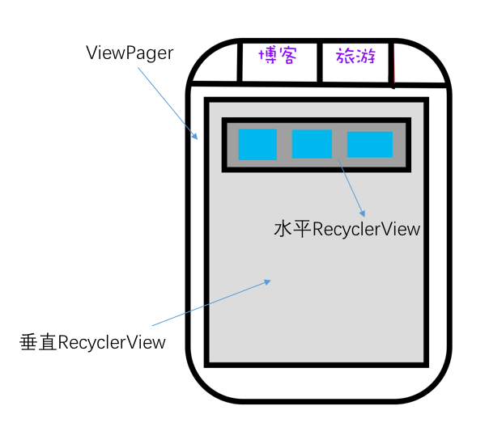

## 主要功能展示和代码实现

2015年10月份左右，差不多花了一周的时间，实现了一个粗略版本。

截止目前，实现了包括新闻下的包括头条、体育、娱乐的一系列的新闻展示，以及点击后进入的新闻详情展示。

<!--more-->

### 目前效果

* 目前效果：

### 更新：

* 2018-11-02 随手加上下拉刷新和上拉加载更多。 接口有些bug，所以代码也有些问题，不过可以将就用。。
* 2018-11-02 有人提出一个issue，修复了下，顺带修复了sync failed 的问题
* 2017-01-18 趁着寒假，解决历史遗留的复杂嵌套布局滑动冲突；完成基于[自定义Volley](https://github.com/freedomofme/HandyVolley)的内容预加载而后响应网络回调。

* 2015-XX-XX 新闻内容的详情展示已经实现 

## 技术实现
### 滑动标签 
APP总体底部的4个Fragment切换和在每个Fragment中的ViewPage切换, 采用的是LuckyJayce/ViewPagerIndicator的开源框架：地址是[ViewPagerIndicator](https://github.com/LuckyJayce/ViewPagerIndicator)。

当然,若是初次接触，建议学习[SlidingTabsBasic](https://developer.android.com/samples/SlidingTabsBasic/index.html),Google官方教程，简洁实现SlidingTab。

### 列表实现
新闻列表采用纵向RecyclerView，其中暂时划分为3种类型。

	public static enum ITEM_TYPE {
        ITEM_TYPE_BANNER,
        ITEM_TYPE_IMAGE,
        ITEM_TYPE_TEXT
    }
分别表示以下3种类型：

- BANNER：

- TEXT：

- IMAGE：

 
- ITEM_TYPE_BANNER 采用自定义SwitchImage控件
- ITEM_TYPE_TEXT 相对布局
- ITEM_TYPE_IMAGE 水平RecycleView （官方版本为三张图片）

### 水平列表效果

本部分介绍ITEM_TYPE_IMAGE的水平滑动列表如何实现。

经过一番努力，现已实现了列表能够响应以下三种情景：

- 滑动ITEM_TYPE_IMAGE时：
	会先根据滑动夹角判断是水平滑动还是上下滑动。
 	- 如果是水平滑动。滑动时，水平列表滑动。如果水平列表滑动尽头，也不会触发新闻栏目的切换。
	- 如果是垂直滑动。则相应整个列表的上下滑动。
	- 如果用户滑动很短距离（很短时间）就抬起手指，则触发点击事件。

### 水平列表事件冲突处理

#### 1. 实现方式
水平滑动的处理方式一般有ViewPage，Gallery，HorizontalScrollview等几种。

这里采用在垂直RecycleView中嵌套水平RecycleView。
主要的布局结构是这样的：

#### 2.存在问题
如果不进行如何额外的处理，那么看上去一些正常。但是每次将水平列表滑动尽头并继续滑动时，会触发Viewpage的页面切换。

**趁着寒假，已经把这个问题分析处理了。**
[解决过程和思路完全复盘，值得一看！](http://freedomofme.github.io/开发/多重嵌套布局下滑动冲突解决方案和思路)

<del>  但是当我想对水平RecyclerView中的某张图片进行点击时，出现了onClick函数没有回调的问题，由于笔者水平和时间有限，暂时没有深究这个问题。</del>

<del>于是采用了onTouch函数做点击响应的回调, 做了如下简单的判断：</del>

<del> 用户是点击图片还是水平滑动RecyclerIView </del>
<del>

    imageView.setOnTouchListener(new View.OnTouchListener() {
      @Override
     public boolean onTouch(View v, MotionEvent event) {
      //抬起按钮时判断，之前是否滑动了,若没有滑动则响应点击事件
                    if (event.getAction() == MotionEvent.ACTION_UP && !isMoved)
                        mListener.onViewPageTouch((NetworkImageView) v, index);
                    else {
                        isMoved = false;
                    }
                    if (event.getAction() == MotionEvent.ACTION_MOVE) {
                        isMoved = true;
                    }
                    return true;
                }
            });
            
</del>

### 基于自定义Volley预加载和回调刷新

#### 目前效果
首次打开APP时，先显示缓存内容，然后同时请求网络，显示最新内容。

#### 最简单的实现方案
一般的话，可能会使用数据库之类的存储结构来保存历史新闻。但是，我想简化这个过程，依赖于网络请求框架的缓存来实现。

一开始想的是给修改Volley源码，为Response.Listener(T response)接口增加一个回调方法onCacheHit(T response)方案,如以下代码所示。

	 public interface Listener<T> {
        /** Called when a response is received. */
        public void onResponse(T response);
        /** 存在缓存 */
        public void onCacheHit(T response);
    }

不过，经过阅读Volley的源码，发现可以通过修改一个Response的softTTL和TTL来实现以上想法。

于是根据这个想法，修改出了一个HandyVolley的框架，使用文档见于此处--[HandyVolley](https://github.com/freedomofme/HandyVolley)，并发布于Jcente仓库中：

	compile 'site.okhttp.codeyel:HandyVolley:1.0.3'
	

### 顶部沉浸式状态栏实现

参考了这篇文章：
[http://www.jianshu.com/p/f8374d6267ef](http://www.jianshu.com/p/f8374d6267ef)

### 新闻详情实现

首先，根据网络返回的数据的样式确定解析方案：

NewsDisplayActivity.java第70行，展示了一个返回数据Html格式的样例：[https://github.com/freedomofme/Netease/commit/bb6db85de547d4d5243e17e881bc2116122e52d6](https://github.com/freedomofme/Netease/commit/bb6db85de547d4d5243e17e881bc2116122e52d6)

本文采用的方法是通过Android自带的android.text.Html类解析Html和html下标签的图像。
核心代码如下：

		URLImageParser p = new URLImageParser(content, this);
        Spanned htmlSpan = Html.fromHtml(body, p, null);
        content.setText(htmlSpan);

其中的URLImageParser是用来解析标签的，这里有很大的进一步优化的空间。

这类主要是参考该文，并修正了图片尺寸上的问题。[http://stackoverflow.com/questions/15617210/android-html-fromhtml-with-images/15617341#15617341](http://stackoverflow.com/questions/15617210/android-html-fromhtml-with-images/15617341#15617341)

当然，除了用TextView来展示Html（在Android
中就是Spanned类），也可以使用WebView。
两者的主要区别：
* WebView：加载HTML更为方便（笔者觉得），支持的标签更多，与APP交互需要通过JS接口
* TextView： 除了文本显示，对于其他很多交互行为，需要重写函数。开发者对展示细节的控制能力更强。
详细内容可以参考:[这里](https://www.ibm.com/developerworks/cn/web/1407_zhangqian_androidhtml/)

### 数据请求与相应

采用的是Volley框架，并封装了RequestSingletonFactory工厂类来方便请求。
URLs类中采用反射的方式来读取静态URL的数据。

### 接下来

- 完善新闻阅读的排版，对于部分网页存在数据不兼容，导致解析的Bug
- 增加查看新闻评论功能
- 增加用户设置界面

### 下载地址

本项目将在持续更新，更加完善，项目源码地址：
[https://github.com/freedomofme/Netease](https://github.com/freedomofme/Netease)

本开源项目仅供学习，不得作为其他用途
